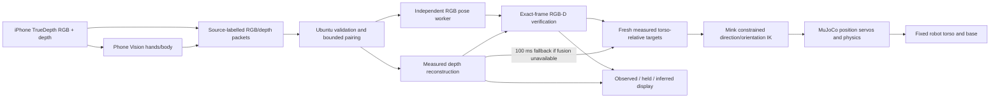

# From a camera frame to a robot command

## Coordinate contract

Camera measurements are transformed into the **current human torso frame**.
Anatomical right/down/forward is mapped into robot forward/left/up. Human motion
within the camera frame therefore does not drive the robot's torso or base.
The torso is frozen in IK and locked with model equality constraints.

Upper-arm direction is `normalize(elbow - shoulder)`; forearm direction is
`normalize(wrist - elbow)`. Mink tasks compare these directions with actual G2
link directions and their analytic Jacobians. Human limb lengths and translation
do not become joint targets. This avoids using endpoint coincidence as a proxy
for matching the whole arm.

The bend plane helps determine upper-arm axial rotation. Near straight/folded
configurations, that plane becomes ambiguous, so hysteresis holds the affected
rotation. Wrist control uses the palm relative to the forearm and a comfortable
neutral offset; its task has zero position cost and only enables wrist joints.

## Observation is distinct from display

Measured metric segment lengths are retained. If a hidden elbow can be inferred
from available shoulder/wrist endpoints, a two-segment arm solver preserves those
lengths and the previous bend plane. Unreachable endpoints are clamped and marked.
Otherwise the last coherent arm is held; unseen geometry stays unknown.

Phone `body_tracking` lengths are **color pixels**, not metres. An inferred elbow
pixel is an uncertain image-space cue; its depth must not be sampled as a measured
elbow when an occluding hand occupies that surface. The persistent amber display
does not supply controller measurements. Session/reset/geometry changes clear history.

## Timing and control

Sensor and preview packets must match session, calibration, source frame, capture
time and color dimensions for PC fusion. Matching neighboring frame numbers by
guessing would conceal disagreement and produce false 3D observations.

Pending work is bounded. After 100 ms without a usable PC result, the receiver
publishes the current phone observation with explicit fallback provenance and its
original age. Late results cannot republish the same frame. Fresh unpaired video
is displayed without another frame's skeleton. Processing/capture gates remain
250 ms; controller freshness is 500 ms. Missing required evidence holds commands.

Fist control is a separate, labelled RGB finger-curl heuristic. Close requires
three sufficiently curled fingers; release requires three extended fingers.
Distinct-frame confirmation and hysteresis reduce chatter. This is not a measured
3D finger-angle classifier and has not had a formal accuracy study.

Detailed historical design notes are in `engineering/`. Those notes preserve the
validation state of each stage; later wrist and stream notes supersede earlier
statements about held wrists and paired-only publication.
