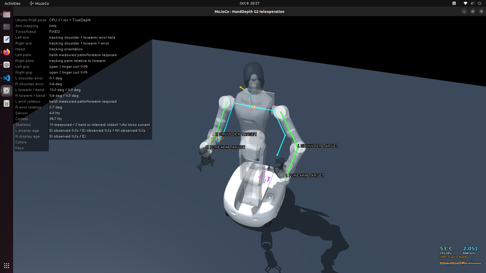
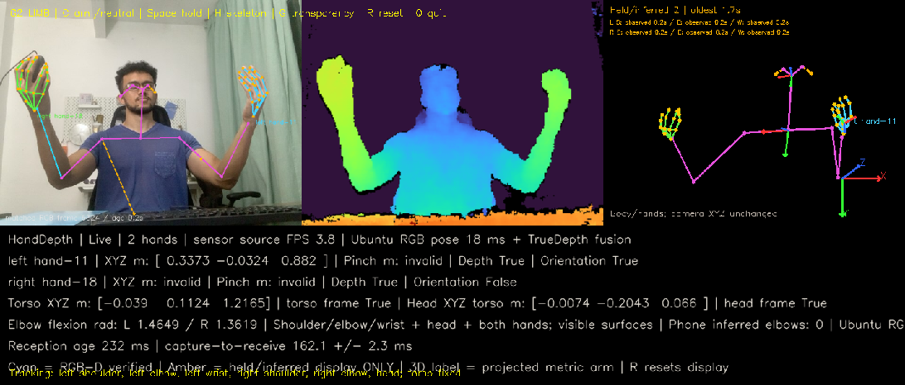

# From an iPhone camera to a humanoid robot: building HandDepth

*Draft engineering journal — simulation prototype, October 2026.*

I began with a practical goal: teach a robot to pick up and place everyday items.
Before training a policy, I needed a way to understand what the robot was seeing,
control it, and eventually collect useful demonstrations. That led me to a more
specific question: could I use an iPhone to make a simulated humanoid follow my
upper-body movements?

The result so far is HandDepth: a custom phone capture pipeline feeding an Ubuntu
receiver, a human pose visualization, and an AgiBot G2 model controlled through
Mink in MuJoCo. The robot's base and torso stay fixed. Its arms and head respond
to motion relative to my torso, with relative wrist control and a fist gesture
for the grippers.

This is the teleoperation foundation of the project. Training a manipulation
policy and validating it on physical hardware are still ahead.

## Start with a useful sensor

My first idea was to treat the phone's two rear cameras as a stereo pair. I moved
to front TrueDepth instead, using its measured depth with RGB and camera
calibration. The phone provides Apple Vision hand and body observations; Ubuntu
reconstructs valid 3D surfaces and can add an independent RGB pose estimate.

The initial target was an iPhone 13, while the documented device tests used an
iPhone XR. This work uses front TrueDepth, not rear LiDAR. Being precise about
that distinction matters when someone tries to reproduce the setup.

I chose MuJoCo with Mink as a practical local simulation and inverse-kinematics
stack. The G2 geometry comes from AgiBot's upstream robot descriptions. My work
is the integration, mapping, uncertainty handling and validation around those
components. I developed the project with Codex assistance and keep the design
decisions and regression tests visible in the repository.

## A hand target did not describe the whole arm

The first mapping concentrated on hand positions. Watching the human skeleton
overlaid on the robot exposed the limitation: a hand could approach its target
while the robot's upper arm pointed in a very different direction.

I changed the control objective to match limb directions in the human torso
frame. For the upper arm, the target is the normalized shoulder-to-elbow vector.
For the forearm, it is the elbow-to-wrist vector. This makes the requested motion
independent of where I sit in the image or how long my arms are.

Those vectors become constrained IK tasks using the G2 model's actual geometry.
They are not human Euler angles copied into robot encoders. The elbow bend plane
also matters: matching a scalar elbow angle alone cannot determine which way a
forearm points in 3D. Near a straight arm, that plane becomes poorly observable,
so the controller holds the ambiguous rotation instead of chasing noise.

The next stage made wrist rotation relative to the forearm. Comfortable neutral
calibration removes the palm/gripper reference offset. A separate RGB finger-curl
heuristic closes the gripper for a fist and releases it for an open hand, with
threshold hysteresis and confirmation across distinct frames.

## Occlusion forced a distinction between “draw it” and “trust it”

The hardest visual failures appeared when a hand hid the forearm or elbow. The
arms were visibly present in RGB and depth, but the skeleton could disappear or
attach to the wrong surface.

I retained reliable metric segment lengths and the previous elbow bend plane.
When current endpoints are sufficient, a two-segment solver reconstructs a
coherent arm without stretching the bones. Unreachable wrists are clamped and
marked. When information is insufficient, the display keeps the last coherent
shape. Geometry that has never been observed remains unknown.

One detail became especially important: the phone's retained arm lengths are
in **image pixels**, not metres. An inferred elbow pixel might land on the hand
occluding it. Sampling that depth would measure the hand's surface and falsely
call it a measured elbow. I separated those image cues from metric evidence.

Cyan means measured geometry. Amber means held or inferred display geometry,
with its age. The controller does not use amber history to bypass freshness
checks. A skeleton remaining on screen and a robot holding position can both be
correct behavior.

## A frozen pose was not always a disconnected stream

Another failure looked like a network dropout. Both phone sockets were still
receiving packets, but the fused pose stopped advancing. Recorded packet IDs
showed why: sensor frames had settled on even IDs and RGB previews on odd IDs.
There was no exact frame pair to fuse.

I kept source matching strict. After a bounded 100 ms wait, Ubuntu can publish
the current phone observation with explicit fallback provenance and its original
age. Late fusion cannot republish that frame. Fresh unpaired RGB stays visible,
without drawing another frame's skeleton on top of it. Matching pairs resume
independent Ubuntu fusion automatically.

The phone still needs coordinated capture selection and backpressure so it sends
both halves of the same sample. A receiver fallback reduces the failure's impact;
it cannot recreate an RGB frame the phone never sent.

## What I can support with evidence

The regression suite covers geometry, source identity, malformed packets,
occlusion, both arms, joint limits, wrist/gripper behavior and stale-input holds.
The release has been checked against a separately rebuilt G2 scene. Historical
replays compare controller changes on identical estimated human inputs.

For example, one 120-second shoulder replay reduced mean direction disagreement
from 52.73° to 2.91° on the left and 69.60° to 4.02° on the right. These are
errors against the **estimated human direction**, measured at repeated controller
ticks. They are not anatomical ground-truth accuracy. The [results page](../RESULTS.md)
also reports less favorable elbow/wrist cases and measurement availability.

A recorded 60-second stream check continued at about 7.26 Hz with no stale samples
among 300 status observations. That test had no person visible, so it supports
transport continuity rather than a motion-tracking claim. The supplied demo
screenshots show a slower session, around 3.6–4.3 Hz. Performance is variable and
still needs a repeatable end-to-end benchmark.

## Where the project goes next

I want to publish the Swift app alongside the Ubuntu release, improve sustained
frame pairing, and measure pose error, availability and gesture reliability
under defined conditions. After that comes object interaction and demonstration
collection for pick-and-place learning.

The work has made me more interested in robotics software at the boundary
between perception, control and human interaction. I enjoy debugging those
boundaries: deciding which frame a measurement belongs to, what a joint target
actually means, and when a robot should hold rather than move.

The [MIT-licensed Ubuntu source](https://github.com/Avode/handdepth-teleop), tests,
protocol and engineering notes are available for review. I would welcome
technical feedback and conversations about robotics engineering or research
opportunities.
